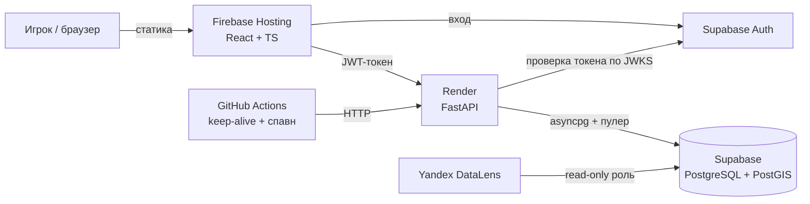

# оГород 🌱🏙️

[](https://github.com/eg000by/samara-go/actions/workflows/ci.yml)

> **оГород** — «огород», в котором спрятан **город**. *Собери весь город — семечко за семечком.*

**Location-based игра-ферма по Санкт-Петербургу.** Семена спавнятся на реальной карте
города; игрок собирает их, только находясь рядом со своей геопозицией (как в Pokémon GO),
сажает на поле 6×6, растит и собирает урожай. Каждое действие пишется в журнал событий —
на нём строится продуктовая аналитика.

Pet-проект, в котором намеренно собраны **три разных инженерных слоя** —
фронтенд, backend и аналитика данных — и всё развёрнуто на **бесплатном хостинге**.

## 🔗 Демо

| | |
|---|---|
| 🎮 Приложение | https://samara-go.web.app |
| ⚙️ API + Swagger | https://piter-go-api.onrender.com/docs |
| 📊 BI-дашборд (DataLens) | https://datalens.ru/ziak00adjaguj |
| 💻 Исходники | https://github.com/eg000by/samara-go |

> ⏳ Бэкенд на бесплатном Render засыпает при простое — первый запрос после паузы
> «будит» сервис 30–60 секунд, дальше всё быстро.

## ✨ Возможности

- 🔐 Регистрация и вход через **Supabase Auth**.
- 🗺️ Карта **OpenStreetMap** с геопозицией игрока и радиусом сбора 50 м.
- 🌱 Сбор семян: 8 видов в 5 уровнях редкости (от Пшеницы до легендарной «Лилии белых ночей»).
- 🌾 Поле **6×6**: посадка из инвентаря, рост по времени, сбор урожая за игровую валюту.
- 📊 Встроенный дашборд (Recharts) + внешний BI-дашборд по событиям (DataLens).

## 🏗️ Архитектура



Стек подобран так, чтобы **каждый слой жил на отдельном бесплатном тарифе**, а архитектура
учитывала их ограничения (см. ниже).

| Слой | Технологии | Хостинг (бесплатно) |
|---|---|---|
| Фронтенд | React 19, TypeScript (strict), Vite, react-leaflet, Redux Toolkit, Recharts | Firebase Hosting |
| Бэкенд | FastAPI, SQLAlchemy 2 (async), Alembic, Pydantic v2, PyJWT | Render |
| База | PostgreSQL + PostGIS, Supabase Auth | Supabase |
| Аналитика | SQL, BI-дашборд | Yandex DataLens (Community) |
| Планировщик | keep-alive + спавн по расписанию | GitHub Actions |

## 🧠 Инженерные решения

Самое интересное в проекте — не механика, а как он спроектирован **вокруг ограничений
бесплатных тарифов** и какие архитектурные решения это потребовало.

- **Ленивый рост растений — без планировщика.** Стадия роста не хранится и не обновляется
  по таймеру, а вычисляется на лету из `planted_at` при чтении поля. Always-on фоновый
  процесс не нужен — это и дешевле, и чище архитектурно.
- **Самовосстанавливающийся спавн.** Бесплатный GitHub-cron сильно троттлит расписания
  (запускался ~раз в час вместо 15 минут), и семена с TTL 30 мин успевали исчезать. Решение:
  `/map` сам досыпает семена, если активных мало. Карта никогда не пустует, даже если cron «проспал».
- **Анти-чит на сервере.** Дистанцию до семени проверяет PostGIS (`ST_DWithin` по
  `geography`), а не клиент — координатам из браузера на слово не верим.
- **Асимметричная проверка JWT.** Токены Supabase (ES256) валидируются по публичному ключу
  с JWKS-эндпоинта — секрета на бэкенде нет вообще, ротация ключей подхватывается сама.
- **Event-sourcing для аналитики.** Каждое действие (`spawn/login/collect/plant/harvest`)
  пишется в таблицу `events` с JSONB-payload — единый источник правды для DAU, воронки,
  retention и тепловой карты сбора.
- **Обход IPv6 и pgbouncer.** Прямой хост Supabase — IPv6-only (Render по нему не ходит),
  поэтому рантайм идёт через transaction-пулер (IPv4) с отключёнными prepared statements
  asyncpg, а миграции — через session-пулер.
- **Alembic поверх существующей БД.** Начальная миграция повторяет схему, БД помечена
  `stamp head`; `include_object` гасит шум autogenerate от PostGIS (`spatial_ref_sys`, FK на `auth`).

## 🗃️ Модель данных

`users` · `seeds_on_map` (`geography(Point)` + GIST-индекс) · `inventory` ·
`field_cells` (стадия роста **не** хранится) · `events` (журнал для аналитики).
Полная схема: [db/schema.example.sql](db/schema.example.sql).

## 🚀 Локальный запуск

**Бэкенд** (Python 3.13):
```bash
cd backend
python -m venv .venv && source .venv/bin/activate
pip install -r requirements.txt
cp .env.example .env          # впиши DATABASE_URL, SUPABASE_URL, CRON_SECRET
uvicorn app.main:app --reload  # http://127.0.0.1:8000/docs
```

**Фронтенд** (Node 22):
```bash
cd frontend
npm install
cp .env.example .env          # впиши VITE_API_URL, VITE_SUPABASE_URL, VITE_SUPABASE_ANON_KEY
npm run dev                    # http://localhost:5173
```

## 🧪 Тесты

| Слой | Стек | Что покрыто |
|---|---|---|
| Backend | pytest | юнит-логика роста/каталога + интеграция API (полный цикл сбор→посадка→урожай, анти-чит) |
| Frontend | Vitest + RTL | редьюсеры Redux, компонент входа |
| E2E | Playwright | сквозной сценарий вход → посадка → урожай через UI |

```bash
cd backend  && pytest                      # backend
cd frontend && npm test                     # unit/компоненты
cd frontend && npm run test:e2e             # e2e (нужны env из e2e/.env.example)
```

CI (GitHub Actions) на каждый push гоняет юнит-тесты и сборку; интеграционные
тесты, требующие ключей Supabase, в CI автоматически пропускаются.

## 📁 Структура репозитория

```
backend/        FastAPI: app/ (роуты, модели, auth, спавн), alembic/
frontend/       Vite + React: src/ (features, store, lib, types)
db/             SQL-схема и проверочные запросы
docs/           игровой дизайн, инструкция по аналитике
.github/        workflows: keep-alive и спавн
render.yaml     Blueprint деплоя бэкенда
firebase.json   конфиг Firebase Hosting
```

## 📚 Документация

- [Игровой дизайн и параметры](docs/game-design.md)
- [Аналитика: подключение DataLens и SQL дашборда](docs/analytics.md)
- [Схема БД](db/schema.example.sql) · [проверочные запросы](db/verify.sql)

---

<sub>Папка репозитория и онлайн-инфраструктура (`samara-go`, `piter-go-api.onrender.com`)
исторически носят прежние имена — проект начинался для Самары, переехал в Санкт-Петербург,
а бренд эволюционировал в **оГород**. Слаги менять не стали, чтобы не ломать деплой и ссылки.</sub>
